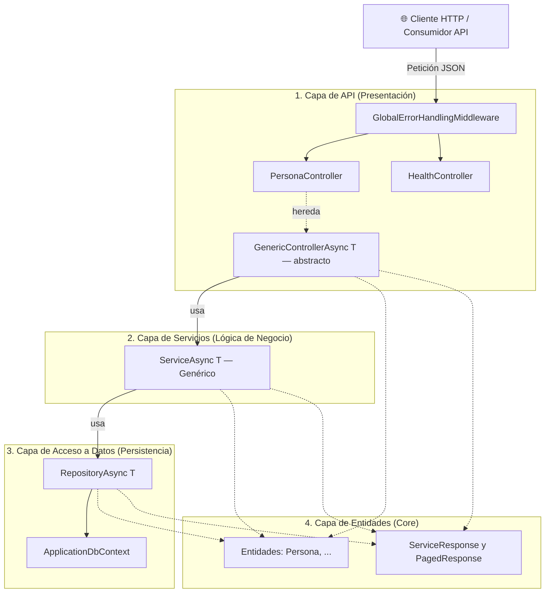

# 📐 Definición de la Arquitectura Base — ProyectoBase

Este documento describe la arquitectura de software implementada en **ProyectoBase**, una plantilla limpia y desacoplada desarrollada sobre **.NET 10.0**. La arquitectura está diseñada bajo los principios de separación de responsabilidades (*Separation of Concerns*) y facilidad de prueba (*Testability*).

---

## 1. Resumen de la Arquitectura

El sistema adopta una **Arquitectura por Capas (N-Layer)**. Las dependencias fluyen estrictamente desde las capas de presentación hacia las capas de acceso a datos e infraestructura:



---

## 2. Descripción de las Capas

### 2.1 Capa de API / Presentación (`Controllers`, `Utility`)
Es el punto de entrada de la aplicación. Se encarga de recibir las solicitudes HTTP, validar los parámetros de entrada y delegar la ejecución a la capa de negocio.
* **Controladores Genéricos (`GenericControllerAsync<T>`):** Clase abstracta base que implementa de forma automática los endpoints RESTful estandarizados (`GetAll`, `GetById`, `FindQP`, `Create`, `Update`, `Delete`). Cualquier controlador específico (ej. `PersonaController`) puede heredar de este genérico, obteniendo todo el CRUD completo sin escribir código repetitivo.
* **Middleware Global de Errores:** Intercepta cualquier excepción ocurrida en las capas inferiores, traduciéndola a códigos de estado HTTP (`400`, `404`, `500`) y serializando respuestas consistentes.

### 2.2 Capa de Servicios (`Services`)
Es el núcleo funcional de la aplicación (Lógica de Negocio).
* **Servicio Genérico Base (`IServiceAsync<T>` y `ServiceAsync<T>`):** Implementación abstracta que interactúa directamente con el repositorio genérico para las operaciones básicas. 
* **Servicios Específicos:** Heredan de `ServiceAsync<T>`, permitiendo sobreescribir los métodos del CRUD (como `Create` y `Update`) para inyectar validaciones de negocio específicas (ej. DNI duplicado), o bien proveer criterios de filtrado (`BuildCriterio`) u ordenamiento (`BuildOrder`) personalizados para las búsquedas paginadas.

### 2.3 Capa de Acceso a Datos / Persistencia (`DataAccess`)
Se encarga de abstraer y encapsular la comunicación directa con el motor de base de datos (PostgreSQL).
* **Patrón Repositorio Genérico (`IRepositoryAsync<T>`):** Abstrae las operaciones básicas del ORM (Entity Framework Core). Impide que las capas superiores conozcan detalles específicos de Entity Framework, facilitando la prueba de componentes.
* **ApplicationDbContext:** Administra la conexión física y la creación del esquema relacional mediante Fluent API exclusivamente.
* **Convención de Nombres de Tablas (`PB_` prefix):** Dado que la base de datos `database01test` es compartida entre múltiples aplicaciones, todas las tablas del proyecto utilizan el prefijo `PB_` (*ProyectoBase*). El mapeo se realiza en Fluent API con `entity.ToTable("PB_NombreEntidad")`. La clase C# conserva su nombre limpio sin el prefijo.

### 2.4 Capa de Entidades / Core (`Models`)
Es la capa transversal que define la estructura de datos del dominio y los modelos auxiliares. No depende de ninguna otra capa del sistema.
* **Entidades:** Clases POCO puras (ej. `Persona.cs`) sin atributos de infraestructura (`DataAnnotations`), asegurando el desacoplamiento total del modelo de dominio.
* **Objetos de Transporte:** Clases como `ServiceResponse<T>` y `PagedResponse<T>` encargadas de mantener la consistencia en el formato de salida.

> [!IMPORTANT]
> **Decisión de Diseño: Exclusividad de Fluent API**
> Con el fin de mantener un modelo de dominio totalmente limpio y desacoplado, **queda prohibido el uso de Data Annotations** (`[Key]`, `[Required]`, `[StringLength]`, etc.) en las entidades. Todas las reglas de base de datos (claves primarias, campos requeridos, longitudes máximas, tipos de columna, índices únicos y relaciones) se configuran de manera centralizada en `ApplicationDbContext.cs` utilizando **Fluent API**.


---

## 3. Patrones de Diseño Aplicados

1. **Inyección de Dependencias (DI):** Todos los componentes se registran con ciclo de vida `Scoped` (por petición) en `Program.cs` y se inyectan dinámicamente a través de constructores.
2. **Repositorio Genérico:** Centraliza las consultas SQL y las operaciones CRUD básicas en una sola clase reutilizable para todas las entidades.
3. **Servicio y Controlador Genéricos:** Evitan la repetición de código mecánico (boilerplate) para los CRUDs estándar. Reducen al mínimo absoluto la creación de nuevos endpoints, acelerando exponencialmente la incorporación de nuevas entidades al dominio.
4. **Manejo Centralizado de Excepciones (Middleware):** Aísla el control de errores de la API en un único componente transversal.

---

## 4. Pipeline de una Petición HTTP (Flujo de Ejecución)

```
[ Cliente HTTP ]
       │  (Petición GET /Persona/FindQP?searchString=perez&page=1&limit=5)
       ▼
┌────────────────────────────────────────────────────────┐
│ 1. GlobalErrorHandlingMiddleware                       │
│    (Establece bloque try-catch general)                │
└──────────────────────────────────────┬─────────────────┘
                                       │
                                       ▼
┌────────────────────────────────────────────────────────┐
│ 2. PersonaController                                   │
│  (Captura QueryParams, delega a IServiceAsync<Persona>)  │
└──────────────────────────────────────┬─────────────────┘
                                       │
                                       ▼
┌────────────────────────────────────────────────────────┐
│ 3. ServiceAsync<Persona> (Genérico)                    │
│    (Ejecuta lógica CRUD, filtros y ordenamiento)       │
└──────────────────────────────────────┬─────────────────┘
                                       │
                                       ▼
┌────────────────────────────────────────────────────────┐
│ 4. RepositoryAsync<Persona>                            │
│    (Ejecuta consulta filtrada y paginada en DB)        │
└──────────────────────────────────────┬─────────────────┘
                                       │
                                       ▼
                     [ PostgreSQL / SQL Server ]
```

---

## 5. Estandarización de Respuestas de la API

Cualquier endpoint expuesto por la aplicación retorna un contrato único:

### A. Respuesta Exitosa Simple
```json
{
  "data": {
    "idPersona": 1,
    "nombre": "Juan",
    "apellido": "Pérez",
    "fechaNacimiento": "1990-05-15T00:00:00",
    "dni": "35123456",
    "email": "juan.perez@example.com",
    "celular": "2231234567"
  },
  "success": true,
  "errorMessage": null
}
```

### B. Respuesta Exitosa Paginada
```json
{
  "data": {
    "data": [
      {
        "idPersona": 1,
        "nombre": "Juan",
        "apellido": "Pérez"
      }
    ],
    "page": 1,
    "limit": 10,
    "totalRows": 1,
    "totalPage": 1
  },
  "success": true,
  "errorMessage": null
}
```

### C. Respuesta con Error (BadRequest / NotFound)
```json
{
  "data": null,
  "success": false,
  "errorMessage": "Ya existe una persona registrada con el DNI 35123456."
}
```

---

## 6. Mapeo de Flujo del Trinomio Genérico

La combinación de **Controlador Genérico**, **Servicio Genérico** y **Repositorio Genérico** opera de forma totalmente simétrica. La siguiente tabla mapea cómo se enlazan las llamadas asíncronas entre cada capa del sistema:

| Operación | Endpoint (Controlador Base) | Método de Servicio (`ServiceAsync<T>`) | Método de Repositorio (`RepositoryAsync<T>`) | Acción sobre DB (EF Core / SQL) |
| :--- | :--- | :--- | :--- | :--- |
| **Listar Todo** | `GET /[Entity]/GetAll` | `GetAll()` | `GetAll()` | `SELECT * FROM [Entity]` |
| **Buscar por ID** | `GET /[Entity]/GetById?id={id}` | `GetByID(id)` *(valida existencia)* | `GetByID(id)` | `SELECT * FROM [Entity] WHERE PK = id` |
| **Crear** | `POST /[Entity]` | `Create(entity)` *(valida negocio)* | `Insert(entity)` | `INSERT INTO [Entity] ...` |
| **Actualizar** | `PUT /[Entity]` | `Update(entity)` *(valida negocio)* | `Update(entity)` | `UPDATE [Entity] SET ... WHERE PK = id` |
| **Eliminar** | `DELETE /[Entity]/{id}` | `Delete(id)` *(valida existencia)* | `Delete(id)` | `DELETE FROM [Entity] WHERE PK = id` |
| **Búsqueda Paginada** | `GET /[Entity]/FindQP` | `FindBy(qp)` & `Count(qp)` | `GetAllDTO(...)` & `Count(...)` | `SELECT ... LIMIT limit OFFSET offset` |

---

## 7. Guía Práctica: Cómo Agregar una Nueva Entidad en 3 Pasos

Este diseño genérico reduce al mínimo el código repetitivo. Para registrar una nueva entidad (por ejemplo, `Producto`) con su CRUD de API y listado paginado completamente funcional, solo debes seguir estos 3 pasos:

### 📸 Paso 1: Crear el Modelo de Entidad (`Models/Producto.cs`)
Define tu clase POCO de forma pura (sin utilizar `Data Annotations` de ningún tipo):

```csharp
namespace ProyectoBase.Models
{
    public class Producto
    {
        public int IDProducto { get; set; }
        public string Nombre { get; set; }
        public decimal Precio { get; set; }
    }
}
```

A continuación, registra el `DbSet<Producto>` en `ApplicationDbContext.cs` y define sus restricciones relacionales utilizando **Fluent API** en el método `OnModelCreating`:

> [!NOTE]
> Aplicar siempre el prefijo `PB_` en `ToTable()` para respetar la convención de tablas del proyecto en la base de datos compartida.

```csharp
public DbSet<Producto> Productos { get; set; }

protected override void OnModelCreating(ModelBuilder modelBuilder)
{
    base.OnModelCreating(modelBuilder);

    // ... configuración de otras entidades ...

    modelBuilder.Entity<Producto>(entity =>
    {
        // Prefijo PB_ obligatorio: base de datos compartida entre aplicaciones
        entity.ToTable("PB_Producto");
        
        // Clave primaria
        entity.HasKey(e => e.IDProducto);
        
        // Propiedades obligatorias y longitudes
        entity.Property(e => e.Nombre)
              .IsRequired()
              .HasMaxLength(150);

        entity.Property(e => e.Precio)
              .IsRequired()
              .HasColumnType("decimal(18,2)");
    });
}
```


### 🚀 Paso 2: Crear el Servicio (`Services/ProductoService/ProductoService.cs`)
Crea la clase heredando de la estructura genérica base `ServiceAsync<Producto>`:

```csharp
using ProyectoBase.DataAccess.Interfaces;
using ProyectoBase.Models;

namespace ProyectoBase.Services.ProductoService
{
    public class ProductoService : ServiceAsync<Producto>
    {
        public ProductoService(IRepositoryAsync<Producto> repository) : base(repository)
        {
        }
        
        // Opcional: Sobrescribir BuildCriterio si se desea habilitar filtros de búsqueda
    }
}
```

### 🎮 Paso 3: Crear el Controlador (`Controllers/ProductoController.cs`)
Hereda del controlador genérico y pasa la interfaz de servicio genérica al constructor base:
```csharp
using Microsoft.AspNetCore.Mvc;
using ProyectoBase.Models;
using ProyectoBase.Services;

namespace ProyectoBase.Controllers
{
    [ApiController]
    [Route("[controller]")]
    public class ProductoController : GenericControllerAsync<Producto>
    {
        public ProductoController(IServiceAsync<Producto> service) : base(service)
        {
        }
    }
}
```

> [!NOTE]
> Dado que se usa el registro genérico abierto, **no se requiere** registrar manualmente `IServiceAsync<Producto>` en `Program.cs`. El contenedor resuelve automáticamente `ServiceAsync<Producto>` para cualquier entidad.

**¡El controlador y la API ya están funcionales!** Para persistir los cambios en la base de datos, continúa con el Paso 4.

### 🗄️ Paso 4: Generar y Aplicar la Migration

Cada vez que se agrega o modifica una entidad, se debe generar una nueva migration y aplicarla a la base de datos:

**4.1 — Generar la migration:**
```powershell
dotnet ef migrations add AgregarProducto --output-dir Migrations
```

**4.2 — Exportar el script SQL idempotente a la carpeta `scripts/`:**
```powershell
dotnet ef migrations script --output "scripts/002_AgregarProducto.sql" --idempotent
```
> El flag `--idempotent` genera un script que puede ejecutarse múltiples veces sin error, usando bloques `IF NOT EXISTS`. El archivo se versiona en la carpeta `scripts/` como registro histórico de cambios al esquema.

**4.3 — Aplicar la migration a PostgreSQL:**
```powershell
dotnet ef database update
```

**Convención de nombres para scripts:** `NNN_NombreDescriptivo.sql` donde `NNN` es un número secuencial de 3 dígitos (`001`, `002`, etc.).

**¡Listo!** La tabla `PB_Producto` quedará creada en la base de datos con todas sus restricciones.

---

## 8. Código de Implementación del Trinomio Genérico Completo

A continuación se detalla el código completo y la explicación técnica de las interfaces y clases que conforman el núcleo genérico de la arquitectura.

### 8.1 Capa de Acceso a Datos (Persistencia)

El **Repositorio Genérico** encapsula a Entity Framework Core, impidiendo que la lógica de negocio dependa directamente de detalles del ORM. Esto permite cambiar el motor de datos o implementar pruebas unitarias (mocking) de forma sencilla.

#### Interface: `IRepositoryAsync.cs`
[IRepositoryAsync.cs](file:///c:/DesarrolloGIT/ProyectoBase/Backend/DataAccess/Interfaces/IRepositoryAsync.cs)
```csharp
using ProyectoBase.Models;
using System;
using System.Collections.Generic;
using System.Linq.Expressions;
using System.Threading.Tasks;

namespace ProyectoBase.DataAccess.Interfaces
{
    public interface IRepositoryAsync<T> : IDisposable where T : class
    {
        Task<IEnumerable<T>> GetAll();
        Task<T> GetByID(int? id);
        Task<T> Insert(T entity);
        Task<T> Delete(int id);
        Task Update(T entity);
        Task<T> Find(Expression<Func<T, bool>> expr);
        Task<IEnumerable<TResult>> GetAllDTO<TResult>(
            Expression<Func<T, bool>> criterio,
            Expression<Func<T, TResult>> selector,
            bool? orderbydescending,
            PageInfo pageInfo,
            params Expression<Func<T, object>>[] order) where TResult : class;

        int Count(Expression<Func<T, bool>> criterio);
        Task Save();
    }
}
```

#### Implementación: `RepositoryAsync.cs`
[RepositoryAsync.cs](file:///c:/DesarrolloGIT/ProyectoBase/Backend/DataAccess/Servicios/RepositoryAsync.cs)
```csharp
using Microsoft.EntityFrameworkCore;
using ProyectoBase.DataAccess.Interfaces;
using ProyectoBase.Models;
using System;
using System.Collections.Generic;
using System.Linq;
using System.Linq.Expressions;
using System.Threading.Tasks;

namespace ProyectoBase.DataAccess.Servicios
{
    public class RepositoryAsync<T> : IRepositoryAsync<T> where T : class
    {
        private readonly ApplicationDbContext context;
        private bool disposed = false;

        public RepositoryAsync(ApplicationDbContext context)
        {
            this.context = context;
        }

        protected DbSet<T> EntitySet => context.Set<T>();

        public async Task<IEnumerable<T>> GetAll()
        {
            return await EntitySet.ToListAsync();
        }

        public async Task<T> GetByID(int? id)
        {
            return await EntitySet.FindAsync(id);
        }

        public async Task<T> Insert(T entity)
        {
            await EntitySet.AddAsync(entity);
            await Save();
            return entity;
        }

        public async Task<T> Delete(int id)
        {
            T entity = await EntitySet.FindAsync(id);
            if (entity != null)
            {
                EntitySet.Remove(entity);
                await Save();
            }
            return entity;
        }

        public async Task Update(T entity)
        {
            context.Entry(entity).State = EntityState.Modified;
            await Save();
        }

        public async Task<T> Find(Expression<Func<T, bool>> expr)
        {
            return await EntitySet.AsNoTracking().FirstOrDefaultAsync(expr);
        }

        public async Task<IEnumerable<TResult>> GetAllDTO<TResult>(
            Expression<Func<T, bool>> criterio,
            Expression<Func<T, TResult>> selector,
            bool? orderbydescending,
            PageInfo pageInfo,
            params Expression<Func<T, object>>[] order) where TResult : class
        {
            IQueryable<T> query = EntitySet.AsQueryable();

            if (criterio != null)
            {
                query = query.Where(criterio);
            }

            if (order != null && order.Length > 0)
            {
                IOrderedQueryable<T> ordenado;
                if (orderbydescending == true)
                {
                    ordenado = query.OrderByDescending(order[0]);
                    for (int i = 1; i < order.Length; i++)
                    {
                        ordenado = ordenado.ThenByDescending(order[i]);
                    }
                }
                else
                {
                    ordenado = query.OrderBy(order[0]);
                    for (int i = 1; i < order.Length; i++)
                    {
                        ordenado = ordenado.ThenBy(order[i]);
                    }
                }
                query = ordenado;
            }

            IQueryable<TResult> queryFinal = selector != null 
                ? query.Select(selector) 
                : (IQueryable<TResult>)query;

            if (pageInfo != null)
            {
                queryFinal = queryFinal.Skip((pageInfo.Page - 1) * pageInfo.Limit).Take(pageInfo.Limit);
            }

            return await queryFinal.ToListAsync();
        }

        public int Count(Expression<Func<T, bool>> criterio)
        {
            return criterio != null 
                ? EntitySet.Where(criterio).Count() 
                : EntitySet.Count();
        }

        public async Task Save()
        {
            await context.SaveChangesAsync();
        }

        protected virtual void Dispose(bool disposing)
        {
            if (!this.disposed && disposing)
            {
                context.Dispose();
            }
            this.disposed = true;
        }

        public void Dispose()
        {
            Dispose(true);
            GC.SuppressFinalize(this);
        }
    }
}
```

---

### 8.2 Capa de Servicios (Lógica de Negocio)

El **Servicio Genérico** actúa como intermediario entre el controlador y la persistencia. Contiene la lógica CRUD estándar y expone hooks virtuales (`BuildCriterio` y `BuildOrder`) que las clases específicas pueden sobrescribir para añadir comportamientos de consulta y reglas del negocio sin duplicar el flujo asíncrono.

#### Interface: `IServiceAsync.cs`
[IServiceAsync.cs](file:///c:/DesarrolloGIT/ProyectoBase/Backend/Services/IServiceAsync.cs)
```csharp
using ProyectoBase.Models;
using System.Collections.Generic;
using System.Threading.Tasks;

namespace ProyectoBase.Services
{
    public interface IServiceAsync<T> where T : class
    {
        Task<IEnumerable<T>> GetAll();
        Task<T> GetByID(int id);
        Task<T> Create(T entity);
        Task<T> Update(T entity);
        Task Delete(int id);
        Task<IEnumerable<T>> FindBy(QueryParams qp);
        int Count(QueryParams qp);
    }
}
```

#### Implementación: `ServiceAsync.cs`
[ServiceAsync.cs](file:///c:/DesarrolloGIT/ProyectoBase/Backend/Services/ServiceAsync.cs)
```csharp
using ProyectoBase.DataAccess.Interfaces;
using ProyectoBase.Exceptions;
using ProyectoBase.Models;
using System;
using System.Collections.Generic;
using System.Linq.Expressions;
using System.Threading.Tasks;

namespace ProyectoBase.Services
{
    public class ServiceAsync<T> : IServiceAsync<T> where T : class
    {
        protected readonly IRepositoryAsync<T> _repository;

        public ServiceAsync(IRepositoryAsync<T> repository)
        {
            _repository = repository;
        }

        public virtual async Task<IEnumerable<T>> GetAll()
        {
            return await _repository.GetAll();
        }

        public virtual async Task<T> GetByID(int id)
        {
            var entity = await _repository.GetByID(id);
            if (entity == null)
            {
                throw new NotFoundException($"Registro con ID {id} no encontrado en {typeof(T).Name}.");
            }
            return entity;
        }

        public virtual async Task<T> Create(T entity)
        {
            if (entity == null)
            {
                throw new BadRequestException("La entidad provista es nula.");
            }
            return await _repository.Insert(entity);
        }

        public virtual async Task<T> Update(T entity)
        {
            if (entity == null)
            {
                throw new BadRequestException("La entidad provista es nula.");
            }
            await _repository.Update(entity);
            return entity;
        }

        public virtual async Task Delete(int id)
        {
            var entity = await _repository.GetByID(id);
            if (entity == null)
            {
                throw new NotFoundException($"Registro con ID {id} no encontrado para eliminar en {typeof(T).Name}.");
            }
            await _repository.Delete(id);
        }

        public virtual async Task<IEnumerable<T>> FindBy(QueryParams qp)
        {
            var criterio = BuildCriterio(qp);
            var pageInfo = new PageInfo(qp.page ?? 1, qp.limit ?? 10);
            
            return await _repository.GetAllDTO(
                criterio,
                e => e,
                false,
                pageInfo,
                BuildOrder(qp)
            );
        }

        public virtual int Count(QueryParams qp)
        {
            var criterio = BuildCriterio(qp);
            return _repository.Count(criterio);
        }

        protected virtual Expression<Func<T, bool>> BuildCriterio(QueryParams qp)
        {
            return null; // Por defecto sin filtro
        }

        protected virtual Expression<Func<T, object>>[] BuildOrder(QueryParams qp)
        {
            return new Expression<Func<T, object>>[0]; // Por defecto sin orden específico
        }
    }
}
```

---

### 8.3 Capa de Endpoints (Controlador Genérico)

El **Controlador Genérico** expone una interfaz REST estándar para cualquier entidad, delegando toda la lógica al Servicio Genérico e inyectando un formateo de salida homogéneo (`ServiceResponse`).

#### Implementación: `GenericControllerAsync.cs`
[GenericControllerAsync.cs](file:///c:/DesarrolloGIT/ProyectoBase/Backend/Controllers/GenericControllerAsync.cs)
```csharp
using Microsoft.AspNetCore.Mvc;
using ProyectoBase.Models;
using ProyectoBase.Services;
using System.Collections.Generic;
using System.Threading.Tasks;

namespace ProyectoBase.Controllers
{
    [ApiController]
    [Route("[controller]")]
    public abstract class GenericControllerAsync<T> : ControllerBase where T : class
    {
        protected readonly IServiceAsync<T> _service;

        protected GenericControllerAsync(IServiceAsync<T> service)
        {
            _service = service;
        }

        [HttpGet("GetAll")]
        public virtual async Task<ActionResult<ServiceResponse<IEnumerable<T>>>> GetAll()
        {
            var items = await _service.GetAll();
            return Ok(new ServiceResponse<IEnumerable<T>>(items));
        }

        [HttpGet("GetById")]
        public virtual async Task<ActionResult<ServiceResponse<T>>> GetById(int id)
        {
            var item = await _service.GetByID(id);
            return Ok(new ServiceResponse<T>(item));
        }

        [HttpGet("FindQP")]
        public virtual async Task<ActionResult<ServiceResponse<PagedResponse<T>>>> FindQP([FromQuery] QueryParams qp)
        {
            var items = await _service.FindBy(qp);
            var total = _service.Count(qp);

            var pagedResponse = new PagedResponse<T>(
                (List<T>)items,
                qp.page ?? 1,
                qp.limit ?? 10,
                total
            );

            return Ok(new ServiceResponse<PagedResponse<T>>(pagedResponse));
        }

        [HttpPost]
        public virtual async Task<ActionResult<ServiceResponse<T>>> Create([FromBody] T entity)
        {
            var newItem = await _service.Create(entity);
            return Ok(new ServiceResponse<T>(newItem));
        }

        [HttpPut]
        public virtual async Task<ActionResult<ServiceResponse<T>>> Update([FromBody] T entity)
        {
            var updatedItem = await _service.Update(entity);
            return Ok(new ServiceResponse<T>(updatedItem));
        }

        [HttpDelete("{id}")]
        public virtual async Task<ActionResult<ServiceResponse<object>>> Delete(int id)
        {
            await _service.Delete(id);
            return Ok(new ServiceResponse<object>(data: null));
        }
    }
}
```

---

### 8.4 Health Check (`Controllers/HealthController.cs`)

El **HealthController** es un controlador independiente — no forma parte del trinomio genérico. Expone un único endpoint sin dependencias de base de datos ni servicios para verificar que el proceso está vivo. Es fundamental para el monitoreo en plataformas cloud como Render.

#### Implementación: [`HealthController.cs`](file:///c:/DesarrolloGIT/ProyectoBase/Backend/Controllers/HealthController.cs)

```csharp
using Microsoft.AspNetCore.Mvc;

namespace ProyectoBase.Controllers
{
    [ApiController]
    [Route("[controller]")]
    public class HealthController : ControllerBase
    {
        [HttpGet("alive")]
        public IActionResult Alive()
        {
            return Ok(new
            {
                status = "ok",
                service = "ProyectoBase Backend",
                timestamp = DateTime.UtcNow,
                environment = Environment.GetEnvironmentVariable("ASPNETCORE_ENVIRONMENT") ?? "Production"
            });
        }
    }
}
```

**Endpoint disponible:**

| Método | Ruta | Descripción |
|---|---|---|
| `GET` | `/health/alive` | Verifica que el proceso está vivo y responde |

**Respuesta:**
```json
{
  "status": "ok",
  "service": "ProyectoBase Backend",
  "timestamp": "2026-06-04T11:00:00Z",
  "environment": "Production"
}
```

> [!NOTE]
> En Render, configurar `/health/alive` como **Health Check Path** del Web Service para que la plataforma monitoree automáticamente el servicio y lo reinicie si deja de responder.

---

### 8.5 Middleware y Excepciones de Dominio

El manejo de errores del sistema se divide en dos partes complementarias: el middleware que intercepta y formatea cualquier excepción, y las excepciones tipadas que la capa de negocio lanza para comunicar errores semánticos.

#### Middleware: [`GlobalErrorHandlingMiddleware.cs`](file:///c:/DesarrolloGIT/ProyectoBase/Backend/Utility/GlobalErrorHandlingMiddleware.cs)

Intercepta cualquier excepción no controlada del pipeline y la transforma en una respuesta HTTP estructurada usando el contrato estándar `ServiceResponse<T>`.

```csharp
using Microsoft.AspNetCore.Http;
using Newtonsoft.Json;
using ProyectoBase.Exceptions;
using ProyectoBase.Models;
using System;
using System.Net;
using System.Threading.Tasks;

namespace ProyectoBase.Utility
{
    public class GlobalErrorHandlingMiddleware
    {
        private readonly RequestDelegate _next;

        public GlobalErrorHandlingMiddleware(RequestDelegate next)
        {
            _next = next;
        }

        public async Task Invoke(HttpContext context)
        {
            try
            {
                await _next(context);
            }
            catch (Exception ex)
            {
                await HandleExceptionAsync(context, ex);
            }
        }

        private static Task HandleExceptionAsync(HttpContext context, Exception exception)
        {
            var code = HttpStatusCode.InternalServerError;
            string message = "Ocurrió un error interno en el servidor.";

            if (exception is BadRequestException)
            {
                code = HttpStatusCode.BadRequest;
                message = exception.Message;
            }
            else if (exception is NotFoundException)
            {
                code = HttpStatusCode.NotFound;
                message = exception.Message;
            }
            else if (exception is UnauthorizedAccessException)
            {
                code = HttpStatusCode.Unauthorized;
                message = "Acceso no autorizado.";
            }

            var response = new ServiceResponse<object>(success: false, errorMessage: message);
            var result = JsonConvert.SerializeObject(response);

            context.Response.ContentType = "application/json";
            context.Response.StatusCode = (int)code;

            return context.Response.WriteAsync(result);
        }
    }
}
```

**Mapeo de excepciones → HTTP:**

| Excepción | HTTP Status | Cuándo se lanza |
|---|---|---|
| `BadRequestException` | `400 Bad Request` | Entidad nula o validación de negocio fallida |
| `NotFoundException` | `404 Not Found` | ID no existe en la base de datos |
| `UnauthorizedAccessException` | `401 Unauthorized` | Acceso sin autorización |
| Cualquier otra | `500 Internal Server Error` | Error inesperado no clasificado |

#### Excepciones de Dominio (`Exceptions/`)

Excepciones tipadas que permiten a la capa de servicio comunicar errores semánticos al middleware sin depender de códigos HTTP directamente, respetando el principio de separación de responsabilidades:

```csharp
// BadRequestException.cs
namespace ProyectoBase.Exceptions
{
    public class BadRequestException : Exception
    {
        public BadRequestException(string message) : base(message) { }
    }
}

// NotFoundException.cs
namespace ProyectoBase.Exceptions
{
    public class NotFoundException : Exception
    {
        public NotFoundException(string message) : base(message) { }
    }
}
```

---

## 9. Caso de Uso de Ejemplo: La Entidad Persona

Para demostrar la elegancia, extensibilidad y rigurosidad del trinomio genérico, el proyecto implementa la entidad **Persona** como caso de uso modelo. Esta entidad cuenta con validaciones comerciales críticas (como unicidad de DNI y Email) y búsquedas paginadas avanzadas sobre sus campos.

### 9.1 El Modelo de Datos y DbContext

#### Entidad: `Persona.cs`
[Persona.cs](file:///c:/DesarrolloGIT/ProyectoBase/Backend/Models/Persona.cs)
Define los atributos específicos del dominio de forma pura (POCO - Plain Old CLR Object) sin ningún tipo de acoplamiento a atributos de infraestructura (`DataAnnotations`).
```csharp
using System;

namespace ProyectoBase.Models
{
    public class Persona
    {
        public int IDPersona { get; set; }
        public string Nombre { get; set; }
        public string Apellido { get; set; }
        public DateTime FechaNacimiento { get; set; }
        public string Dni { get; set; }
        public string Email { get; set; }
        public string Celular { get; set; }
    }
}
```

#### Contexto: `ApplicationDbContext.cs`
[ApplicationDbContext.cs](file:///c:/DesarrolloGIT/ProyectoBase/Backend/Models/ApplicationDbContext.cs)
Configura todas las claves, restricciones, longitudes y reglas de base de datos de manera centralizada utilizando **Fluent API** en el método `OnModelCreating`.
```csharp
using Microsoft.EntityFrameworkCore;

namespace ProyectoBase.Models
{
    public class ApplicationDbContext : DbContext
    {
        public ApplicationDbContext(DbContextOptions<ApplicationDbContext> options)
            : base(options)
        {
        }

        public DbSet<Persona> Personas { get; set; }

        protected override void OnModelCreating(ModelBuilder modelBuilder)
        {
            base.OnModelCreating(modelBuilder);

            modelBuilder.Entity<Persona>(entity =>
            {
                // Prefijo PB_: base de datos compartida entre múltiples aplicaciones
                entity.ToTable("PB_Persona");
                
                // Clave primaria
                entity.HasKey(e => e.IDPersona);
                
                // Propiedades obligatorias y longitudes máximas
                entity.Property(e => e.Nombre)
                      .IsRequired()
                      .HasMaxLength(150);

                entity.Property(e => e.Apellido)
                      .IsRequired()
                      .HasMaxLength(150);

                entity.Property(e => e.FechaNacimiento)
                      .IsRequired();

                entity.Property(e => e.Dni)
                      .IsRequired()
                      .HasMaxLength(20);

                entity.Property(e => e.Email)
                      .HasMaxLength(250);

                entity.Property(e => e.Celular)
                      .HasMaxLength(50);
                
                // Índices únicos
                entity.HasIndex(e => e.Dni)
                      .IsUnique();

                entity.HasIndex(e => e.Email)
                      .IsUnique();
            });
        }
    }
}
```

### 9.2 Capa de Lógica de Negocio (Servicio Genérico Puro)

Al implementar el trinomio genérico con máxima pureza, **se elimina por completo la necesidad de tener archivos de servicios específicos** (como `PersonaService.cs`) o interfaces redundantes en la capa de negocio.

La aplicación aprovecha el registro genérico abierto en `Program.cs`:
```csharp
builder.Services.AddScoped(typeof(IServiceAsync<>), typeof(ServiceAsync<>));
```

Gracias a este diseño:
* El `PersonaController` solicita `IServiceAsync<Persona>` en su constructor.
* El contenedor de dependencias asocia dinámicamente esta solicitud con la implementación genérica `ServiceAsync<Persona>`.
* Se reutiliza el 100% del flujo asíncrono y la persistencia de `ServiceAsync<T>` sin necesidad de escribir código repetitivo.
* Para garantizar que no existan registros duplicados en los campos críticos `Dni` e `Email`, el sistema se apoya de forma segura y directa en los índices de unicidad relacional (`IsUnique()`) configurados mediante Fluent API en `ApplicationDbContext.cs`.

### 9.3 Capa de Endpoints (Controlador de Entrada)

El `PersonaController` es un controlador de entrada que hereda de `GenericControllerAsync<Persona>` e inyecta directamente el contrato genérico del servicio `IServiceAsync<Persona>` en su constructor, delegándolo al constructor base.

#### Controlador: `PersonaController.cs`
[PersonaController.cs](file:///c:/DesarrolloGIT/ProyectoBase/Backend/Controllers/PersonaController.cs)
```csharp
using Microsoft.AspNetCore.Mvc;
using ProyectoBase.Models;
using ProyectoBase.Services;

namespace ProyectoBase.Controllers
{
    [ApiController]
    [Route("[controller]")]
    public class PersonaController : GenericControllerAsync<Persona>
    {
        public PersonaController(IServiceAsync<Persona> service) : base(service)
        {
        }
    }
}
```

---

## 10. Conclusiones y Beneficios de la Arquitectura Base

La implementación de esta arquitectura base proporciona múltiples ventajas competitivas para la escalabilidad y mantenibilidad de la aplicación:

1. **Reducción Drástica de Código Boilerplate:** El trinomio genérico permite agregar un CRUD REST completo para una nueva entidad en 4 pasos simples, minimizando errores mecánicos.
2. **Desacoplamiento Estricto:** La capa de persistencia (Entity Framework Core) está totalmente aislada de la capa de APIs mediante interfaces limpias de repositorios asíncronos.
3. **Validación Segura de Negocio:** Los índices únicos en la base de datos (configurados por Fluent API) garantizan integridad referencial sin lógica redundante en servicios.
4. **Mapeos Paginados Consistentes:** A través del mapeador dinámico con expresiones lambda, se resuelven listados con filtros inteligentes de búsqueda y ordenaciones personalizadas de forma fluida y optimizada.
5. **Modelo de Dominio Puro:** La prohibición de Data Annotations en las entidades asegura que el dominio no tiene dependencias de infraestructura, facilitando pruebas unitarias y la portabilidad.

---

## 11. Stack Tecnológico y Paquetes NuGet

El proyecto está construido íntegramente sobre el ecosistema **.NET 10**. Los siguientes paquetes NuGet han sido verificados y están resueltos en su versión estable `10.0.0`:

| Paquete NuGet | Versión Configurada | Versión Resuelta | Propósito |
| :--- | :---: | :---: | :--- |
| `Microsoft.AspNetCore.Mvc.NewtonsoftJson` | `10.0.0-*` | **10.0.0** | Serialización JSON con soporte de referencias circulares |
| `Microsoft.EntityFrameworkCore` | `10.0.0-*` | **10.0.0** | ORM principal para mapeo objeto-relacional |
| `Microsoft.EntityFrameworkCore.SqlServer` | `10.0.0-*` | **10.0.0** | Proveedor SQL Server (disponible como alternativa) |
| `Microsoft.EntityFrameworkCore.Tools` | `10.0.0-*` | **10.0.0** | Herramientas CLI para migrations (`dotnet ef`) |
| `Npgsql.EntityFrameworkCore.PostgreSQL` | `10.0.0-*` | **10.0.0** | Proveedor PostgreSQL activo |
| `Swashbuckle.AspNetCore` | `10.1.7` | **10.1.7** | Generación de documentación OpenAPI / Swagger UI |

> [!NOTE]
> El wildcard `10.0.0-*` en las versiones garantiza que al ejecutar `dotnet restore`, se resolverán automáticamente los patches de seguridad y correcciones de bugs (ej: `10.0.1`, `10.0.2`) sin necesidad de actualizar manualmente el `.csproj`.

> [!TIP]
> Para verificar el estado de paquetes en cualquier momento: `dotnet list package` (instalados) y `dotnet list package --outdated` (actualizaciones dentro del ecosistema 10.x).

### Herramienta CLI de Migrations

| Herramienta | Versión | Comando de verificación |
| :--- | :---: | :--- |
| `dotnet-ef` (global) | **10.0.8** | `dotnet ef --version` |

Para actualizar la herramienta: `dotnet tool update --global dotnet-ef`

---

## 12. Gestión de Migrations y Persistencia en Base de Datos

### 12.1 Configuración de Conexión (`appsettings.json`)

La cadena de conexión a PostgreSQL se configura en `appsettings.json` bajo la clave `ConnectionStrings:DefaultConnection`:

```json
{
  "ConnectionStrings": {
    "DefaultConnection": "User ID=<usuario>;Password=<contraseña>;Host=<host>;Port=5432;Database=<base>;Pooling=true;"
  }
}
```

Esta cadena es leída en `Program.cs` mediante:
```csharp
builder.Services.AddDbContext<ApplicationDbContext>(options =>
    options.UseNpgsql(builder.Configuration.GetConnectionString("DefaultConnection")));
```

> [!CAUTION]
> No commitear credenciales reales en el repositorio. Para entornos productivos, utilizar variables de entorno o un gestor de secretos (ej: `dotnet user-secrets`, Azure Key Vault).

### 12.2 Convención de Prefijo de Tablas (`PB_`)

La base de datos puede ser compartida por múltiples aplicaciones (entorno local/on-premise) o exclusiva del proyecto (ej: base generada automáticamente en Render). En cualquier caso, todas las tablas del proyecto utilizan el prefijo **`PB_`** (*ProyectoBase*) para evitar colisiones de nombres:

| Clase C# (dominio) | Tabla en PostgreSQL |
| :--- | :--- |
| `Persona` | `PB_Persona` |
| `Producto` *(ejemplo)* | `PB_Producto` |
| `CualquierEntidad` | `PB_CualquierEntidad` |

El mapeo se declara en `ApplicationDbContext.cs` con Fluent API:
```csharp
entity.ToTable("PB_NombreEntidad");
```

### 12.3 Flujo Completo de una Migration

```
[Modificar ApplicationDbContext.cs]
         │
         ▼
[dotnet ef migrations add <NombreMigration>]
  → Genera archivos en /Migrations/
         │
         ▼
[dotnet ef migrations script --output scripts/NNN_<Nombre>.sql --idempotent]
  → Exporta el SQL para registro histórico y auditoría
         │
         ▼
[dotnet ef database update]  ← entorno local
  — O —
[db.Database.Migrate() en Program.cs]  ← producción / Render
  → Aplica automáticamente las migrations pendientes al iniciar la app
  → Registra en tabla __EFMigrationsHistory
```

> [!TIP]
> En producción (Render), el proyecto usa `db.Database.Migrate()` al iniciar, por lo que **no es necesario correr `dotnet ef database update` manualmente**. Al hacer deploy, si hay migrations pendientes, se aplican solas en el primer startup.

### 12.4 Historial de Migrations Aplicadas

| # | Nombre | Archivo Script | Fecha | Descripción |
| :---: | :--- | :--- | :---: | :--- |
| 001 | `InitialCreate` | [001_InitialCreate.sql](file:///c:/DesarrolloGIT/ProyectoBase/Backend/scripts/001_InitialCreate.sql) | 2026-05-20 | Creación tabla `PB_Persona` con índices únicos en `Dni` y `Email` |

### 12.5 Schema Actual en PostgreSQL

```sql
-- Tabla: PB_Persona
CREATE TABLE "PB_Persona" (
    "IDPersona"        integer GENERATED BY DEFAULT AS IDENTITY,
    "Nombre"           character varying(150)  NOT NULL,
    "Apellido"         character varying(150)  NOT NULL,
    "FechaNacimiento"  timestamp without time zone NOT NULL,
    "Dni"              character varying(20)   NOT NULL,
    "Email"            character varying(250),
    "Celular"          character varying(50),
    CONSTRAINT "PK_PB_Persona" PRIMARY KEY ("IDPersona")
);

CREATE UNIQUE INDEX "IX_PB_Persona_Dni"   ON "PB_Persona" ("Dni");
CREATE UNIQUE INDEX "IX_PB_Persona_Email" ON "PB_Persona" ("Email");
```

---

## 13. Documentación y Pruebas con Swagger (OpenAPI)

Para facilitar las pruebas de los endpoints de la API sin depender de clientes externos como Postman, se encuentra integrado **Swagger (OpenAPI)** en el proyecto utilizando el paquete `Swashbuckle.AspNetCore`.

### 13.1 Configuración e Integración

La integración se encuentra configurada en `Program.cs` mediante las siguientes líneas:

1. **Registro de Servicios**:
   ```csharp
   // Habilitar la generación de Swagger / OpenAPI
   builder.Services.AddEndpointsApiExplorer();
   builder.Services.AddSwaggerGen();
   ```

2. **Middleware (HTTP Pipeline)**:
   Por motivos de seguridad, la interfaz gráfica de Swagger se expone exclusivamente en el entorno de desarrollo (`Development`):
   ```csharp
   if (app.Environment.IsDevelopment())
   {
       app.UseDeveloperExceptionPage();
       app.UseSwagger();
       app.UseSwaggerUI();
   }
   ```

### 13.2 Acceso en Local

Al ejecutar la aplicación localmente en tu entorno de desarrollo, puedes acceder a la consola interactiva en la siguiente dirección:
```
https://localhost:<puerto>/swagger
```

Desde esta consola interactiva podrás:
* Visualizar todos los controladores y endpoints disponibles de forma ordenada.
* Probar cualquier operación del CRUD (`GET`, `POST`, `PUT`, `DELETE`) en tiempo real mediante el botón **"Try it out"**.
* Visualizar las respuestas de éxito (`200 OK`) y de error formateadas uniformemente por nuestro middleware global.

---

