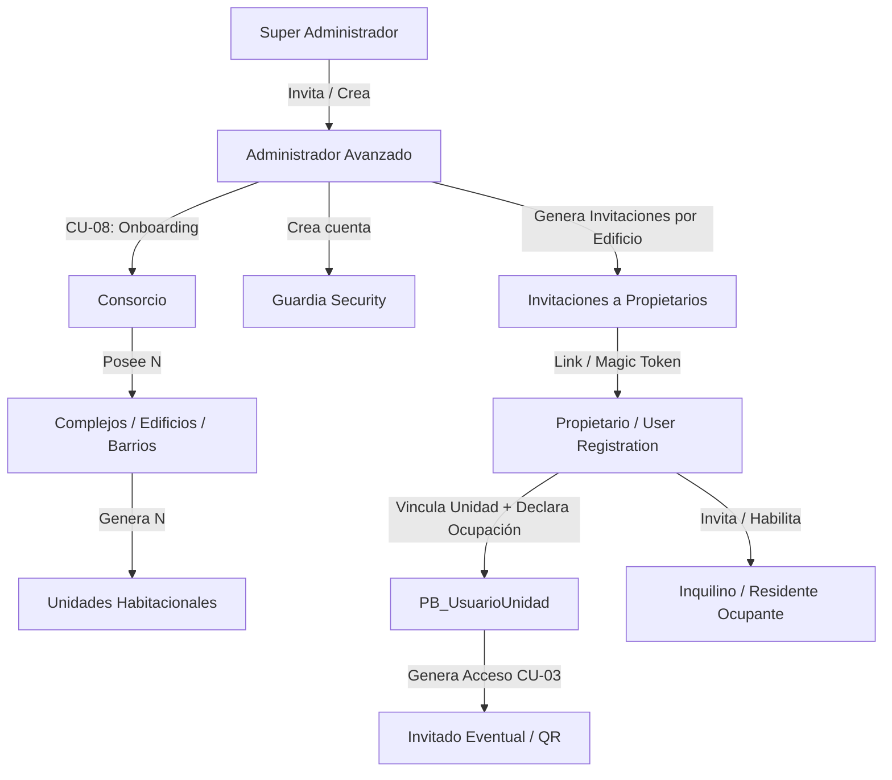

# Plan de Onboarding y Alta de Usuarios por Perfil (UX & Arquitectura)

## 1. Contexto y Objetivos
Este documento define el análisis de Experiencia de Usuario (UX) y el plan de implementación para el **Alta de Usuarios y Onboarding por Perfil** en la plataforma de Gestión de Consorcios y Amenities, extendiendo lo definido en `specs-unificado.md` (especialmente `SPEC-CU08` y `SPEC-AUTH v2` con su modelo de 6 roles).

El objetivo es articular un flujo jerárquico y por invitación donde:
1. El **Super Admin** da de alta a los **Administradores**.
2. El **Administrador Avanzado** da de alta el **Consorcio**, sus **Complejos/Edificios**, **Unidades Habitacionales**, **Amenities** y cuentas de **Guardias**.
3. El Administrador o el sistema genera **Invitaciones** (vía Email/WhatsApp/QR) para los **Propietarios** por cada complejo/edificio.
4. Los **Propietarios** aceptan la invitación, completan sus datos e identifican/vinculan su **Unidad Habitacional**.
5. Los **Propietarios/Inquilinos** gestionan la ocupación real (`EsOcupanteActual`) o autorizan **Inquilinos** adicionales.

---

## 2. Flujo Cascoda y Jerarquía de Registro



---

## 3. Análisis de Experiencia de Usuario (UX) por Perfil / Rol

### A. Super Administrador (`SUPER_ADMINISTRADOR`)
* **Objetivo UX:** Operatoria simple para registrar administraciones/administradores sin involucrarse en la carga interna de consorcios.
* **Experiencia / Flujo UX:**
  1. Accede al panel `/superadmin/administradores`.
  2. Completa formulario básico: *Nombre, Apellido, Email, Razón Social / Administración*.
  3. El sistema envía una **Invitación de Administración**.
  4. Visualiza la tabla de administradores con estado: `Pendiente de Activación`, `Activo`, `Inactivo`.

### B. Administrador Avanzado (`ADMINISTRADOR_AVANZADO`)
* **Objetivo UX:** Configurar la estructura física del consorcio de manera guiada (Wizard) y enviar invitaciones masivas a propietarios sin carga manual repetitiva.
* **Experiencia / Flujo UX:**
  1. **Paso 1 - Datos del Consorcio (`CU-08`):** Nombre, CUIT, Email, Huso Horario, ¿Tiene Guardia Dedicado?
  2. **Paso 2 - Configuración de Complejos/Edificios:** Especifica tipo (*Edificio* o *Barrio Privado*), dirección y torres/bloques.
  3. **Paso 3 - Generación / Carga de Unidades Habitacionales:**
     * Opción A: Carga por rango/matriz (ej. Pisos 1 al 10, Deptos A al D).
     * Opción B: Importación por planilla Excel/CSV (Identificador de unidad + Email/Teléfono pre-asignado si existe).
  4. **Paso 4 - Configuración de Amenities & Guardias:** Setup inicial de amenities, franjas y alta de personal de portería.
  5. **Panel de Gestión de Invitaciones (`/admin/consorcios/{id}/invitaciones`):**
     * Grilla interactiva del edificio donde se ve cada depto/lote con un badge de estado:
       * 🟢 **Registrado / Activo** (Usuario vinculado).
       * 🟡 **Invitación Enviada** (Esperando registro).
       * 🔴 **Sin Invitar** (Unidad vacante o sin email registrado).
     * Botón de **"Enviar Invitaciones Masivas"** o **"Copiar Link / Código QR de Edificio"**.

### C. Propietario (`PROPIETARIO`)
* **Objetivo UX:** Aceptar la invitación en menos de 2 minutos, validar su identidad y declarar su unidad habitacional.
* **Experiencia / Flujo UX:**
  1. **Recepción del Link de Invitación:** Llega por Email, WhatsApp o mediante escaneo de un código QR entregado por la administración.
  2. **Pantalla de Bienvenida (Landing de Invitación):**
     * Muestra datos del edificio: *"Bienvenido al Consorcio Las Heras - Torre A"*.
     * Muestra la unidad pre-asignada o desplegable para seleccionar su unidad (ej: *Depto 4º B*).
  3. **Formulario de Alta / Identificación:**
     * Si es un usuario nuevo: Registra Nombre, Apellido, DNI, Teléfono y Contraseña.
     * Si ya tiene cuenta en la plataforma (propietario en otro consorcio): Simplemente inicia sesión y la nueva unidad se suma a su perfil (`BR-AUTH-010`).
  4. **Declaración y Estado de Vinculación de Unidad:**
     * Al declarar la unidad, el registro de la relación `UsuarioUnidad` queda en estado **`PENDIENTE_APROBACION_ADMIN`**.
     * El Administrador Avanzado recibe una notificación en su panel y valida la titularidad del Propietario.
     * Una vez aprobada por el Admin, la vinculación pasa a estar **`VIGENTE`** y se habilitan todas las funciones de la unidad.
  5. **Declaración de Ocupación:**
     * 🏠 **"Habito la propiedad (Ocupante Actual)"** → Una vez aprobada por el Admin, otorga acceso para realizar reservas (`CU-01`), ver cartelera, etc.
     * 🔑 **"Alquilo la propiedad / Ausente"** → Registra `EsOcupanteActual = false`. El propietario mantiene acceso de supervisión (expensas, incidencias, historial `BR-AUTH-010/011`) y puede invitar directamente a su **Inquilino**.

### D. Inquilino / Residente (`INQUILINO`)
* **Objetivo UX:** Acceso directo e inmediato a los servicios de la vivienda tras ser invitado por el Propietario.
* **Experiencia / Flujo UX:**
  1. Recibe la invitación generada directamente por el **Propietario** de la unidad.
  2. Acepta la invitación, completa sus datos personales (Nombre, Apellido, DNI, Teléfono).
  3. **Alta Directa:** La relación `UsuarioUnidad` se crea de forma inmediata como `VIGENTE` con `TipoRelacion = "INQUILINO"` y `EsOcupanteActual = true`. *(No requiere validación del Administrador, siendo responsabilidad plena del Propietario)*.

---

## 4. Propuesta de Arquitectura e Implementación Backend/Frontend

### A. Nueva Entidad de Dominio: `PB_InvitacionUsuario` y Estado en `PB_UsuarioUnidad`

```csharp
// Models/InvitacionUsuario.cs
public class InvitacionUsuario {
    public int       IDInvitacion         { get; set; }
    public int       IDConsorcio          { get; set; }
    public int?      IDComplejo           { get; set; }
    public int?      IDUnidadHabitacional { get; set; } // Pre-asignada o null si es invitacion abierta a edificio
    public string    EmailDestino         { get; set; }
    public string?   TelefonoDestino      { get; set; }
    public string    Token                { get; set; } // Hash / GUID seguro
    public string    RolDestino           { get; set; } // "ADMINISTRADOR_AVANZADO", "PROPIETARIO", "INQUILINO", "GUARDIA"
    public string    Estado               { get; set; } // "PENDIENTE", "ACEPTADA", "EXPIRADA", "REVOCADA"
    public DateTime  FechaCreacion        { get; set; }
    public DateTime  FechaExpiracion      { get; set; }
    public DateTime? FechaAceptacion      { get; set; }
    public int?      IDUsuarioCreador     { get; set; }
}

// Extensión de Models/UsuarioUnidad.cs (Estado de la relación)
// EstadoRelacion: "PENDIENTE_APROBACION_ADMIN" | "VIGENTE" | "RECHAZADA" | "FINALIZADA"
```

### B. Nuevos Endpoints y DTOs (`Controllers/InvitacionController.cs` y `Controllers/UsuarioUnidadController.cs`)

#### 1. Crear / Enviar Invitación
* `POST /api/invitaciones/crear-admin` `[Authorize(Roles="SUPER_ADMINISTRADOR")]`
* `POST /api/invitaciones/masivas` `[Authorize(Roles="ADMINISTRADOR_AVANZADO")]`
* `POST /api/invitaciones/inquilino` `[Authorize(Roles="PROPIETARIO")]`

#### 2. Validar Token de Invitación (Público)
* `GET /api/invitaciones/validar/{token}`

#### 3. Aceptar Invitación y Registro (Público)
* `POST /api/invitaciones/aceptar`
  * Lógica Orquestada en Servicio:
    1. Valida vigencia del token (`Estado == "PENDIENTE"` y `FechaExpiracion > UtcNow`).
    2. Crea o busca `Usuario` por Email.
    3. Asigna `UsuarioRol` correspondiente (`PROPIETARIO` o `INQUILINO`).
    4. Crea `UsuarioUnidad`:
       * Si es `PROPIETARIO` ➔ EstadoRelacion = `"PENDIENTE_APROBACION_ADMIN"`.
       * Si es `INQUILINO` (invitado por Propietario) ➔ EstadoRelacion = `"VIGENTE"`.
    5. Marca `InvitacionUsuario.Estado = "ACEPTADA"`.

#### 4. Validación por Administrador (`Controllers/UsuarioUnidadController.cs`)
* `GET /api/usuario-unidad/pendientes` `[Authorize(Roles="ADMINISTRADOR_AVANZADO")]` ➔ Lista solicitudes de vinculación pendientes de propietarios.
* `POST /api/usuario-unidad/{id}/aprobar` `[Authorize(Roles="ADMINISTRADOR_AVANZADO")]` ➔ Pasa la relación a `"VIGENTE"`.
* `POST /api/usuario-unidad/{id}/rechazar` `[Authorize(Roles="ADMINISTRADOR_AVANZADO")]` ➔ Rechaza la solicitud con motivo.

---

## 5. Reglas de Negocio Confirmadas

> [!NOTE]
> **Decisiones de Negocio Integradas:**
> 1. **Vinculación de Propietario en Pendiente:** Al declarar o seleccionar una unidad habitacional durante el onboarding, la vinculación `UsuarioUnidad` ingresa en estado `PENDIENTE_APROBACION_ADMIN` hasta que el Administrador Avanzado del consorcio valide la solicitud.
> 2. **Alta Directa de Inquilinos por Propietarios:** Cuando un Propietario invita a un Inquilino para su unidad, la vinculación entra directamente en estado `VIGENTE`. Es responsabilidad total del Propietario la gestión y autorización de sus inquilinos.
> 3. **Multi-Propiedad:** Un mismo usuario propietario puede poseer y supervisar múltiples unidades en el mismo o distintos consorcios.

---

## 6. Plan de Verificación

### Pruebas Unitarias e Integración (Backend)
- `InvitacionServiceTests.cs`:
  - Validar generación y expiración de tokens (7 días de validez).
  - Validar creación de `UsuarioUnidad` con `EstadoRelacion = PENDIENTE_APROBACION_ADMIN` para Propietarios.
  - Validar creación directa `EstadoRelacion = VIGENTE` para Inquilinos invitados por Propietario.
  - Validar endpoints de Aprobación y Rechazo de solicitudes por parte del Admin Avanzado.

### Verificación Manual & Frontend UX
- Probar flujo E2E completo:
  1. Propietario acepta invitación -> Cuenta en estado "Pendiente de validación de unidad por Administración".
  2. Admin Avanzado entra a su panel -> Aprueba la solicitud del Propietario.
  3. Propietario recibe notificación y adquiere acceso activo a su panel de residente.
  4. Propietario genera invitación a Inquilino -> Inquilino se registra e ingresa directamente sin requerir paso por el Admin.
