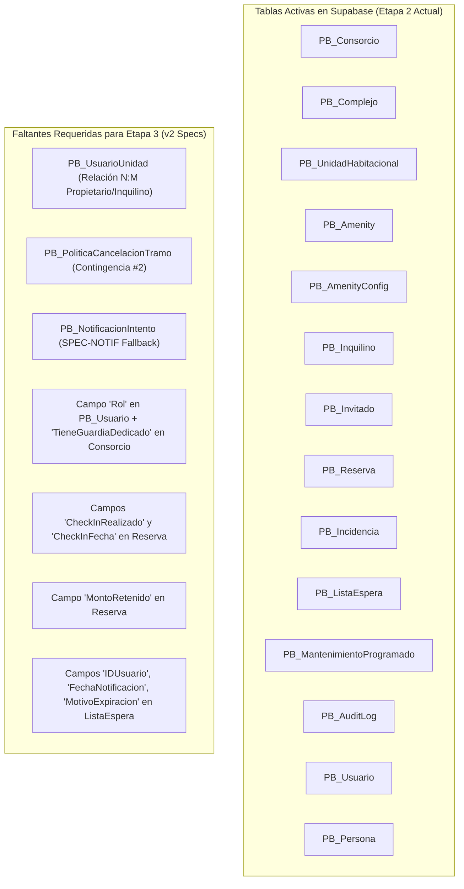

# Documento de Implementación — Etapa 3
## Diagnóstico Real de Supabase (Etapa 2), Comparativa v1 vs v2, Modelos C# y Hoja de Ruta de Migración

---

## 📄 1. Introducción y Contexto

El presente documento constituye la especificación de diseño e implementación técnica para la **Etapa 3** del Sistema de Gestión de Consorcios y Amenities.

Se basa en la auditoría directa del estado del proyecto:
1. **Modelo Inicial de Referencia (`modelo.jpeg`)**: Esquema borrador de 8 tablas con el que se concibió la idea inicial del sistema.
2. **Base de Datos Actual en Supabase (Etapa 2 Implementada)**: Estado real de la base de datos PostgreSQL en Supabase, verificado mediante las migraciones EF Core (`003_Etapa2_Fase1` a `006_Etapa2_Fase4`) y el `ApplicationDbContextModelSnapshot.cs` (14 tablas activas).
3. **Especificación Técnica Unificada (`specs-unificado.md`)**: Versión v2 oficial (Spec-Driven Development - SDD) de 2,004 líneas, que define los requerimientos finales para la **Etapa 3**.

---

## 📊 2. Comparativa General: Especificación v1 vs v2

| Aspecto / Métrica | Versión Anterior (`specs (2)(2)(1).md` - v1) | Versión Unificada (`specs-unificado.md` - v2) | Evolución Técnica |
| :--- | :--- | :--- | :--- |
| **Líneas de Specs** | 1,509 líneas (~60.6 KB) | **2,004 líneas (~99.6 KB)** | **+32.8%** extensión y detalle técnico |
| **Casos de Uso (CUs)** | 11 CUs (`CU-01` a `CU-11`) | **13 CUs** (`CU-01` a `CU-12`, `CU-14`) | Agrega `CU-12` (Disponibilidad) y `CU-14` (Cancelación Masiva) |
| **Modelo de Roles (Auth)** | 4 Roles simples | **6 Roles de negocio** | Separación Admin Avanzado/Liviano e Inquilino/Propietario |
| **Manejo de Contingencias**| Implícito / Básico | **12 Contingencias explícitas** | Integración de no-shows, penalidades, fallbacks, holds |
| **Entidades de Dominio** | 12 entidades POCO | **15 entidades / enmiendas** | Incorporación de `UsuarioUnidad`, `PoliticaCancelacionTramo`, `NotificacionIntento` |

---

## 🗄️ 3. Estado Real de la Base de Datos en Supabase (Etapa 2) vs Especificaciones v2

La base de datos actual en Supabase ya cuenta con las **14 tablas** desplegadas durante la **Etapa 2**:



---

## 🔍 4. Matriz de Brechas Específicas a Desarrollar en Etapa 3

### 4.1 Brechas en Autenticación y Roles (`SPEC-AUTH` v2)
* **Estado Actual en Supabase**: `PB_Usuario` contiene sólo `Username`, `Email`, `Password`, `Activo`. `PB_Inquilino` está desacoplado del login.
* **Brecha a Implementar**:
  1. Agregar la propiedad `Rol` (`string`) a `PB_Usuario` para soportar los 6 roles: `SUPER_ADMINISTRADOR`, `ADMINISTRADOR_AVANZADO`, `ADMINISTRADOR_LIVIANO`, `GUARDIA`, `INQUILINO`, `PROPIETARIO`, `INVITADO`.
  2. Crear la tabla intermedia **`PB_UsuarioUnidad`** para soportar propietarios con múltiples unidades o inquilinos en rotación.
  3. Agregar `TieneGuardiaDedicado` (`bool`, default false) a `PB_Consorcio`.

### 4.2 Brechas en Reservas y Contingencias (`CU-01` & `CU-12`)
* **Brecha a Implementar**:
  1. **Contingencia #1 (No-Show)**:
     - Agregar `CheckInRealizado` (`bool`, default false) y `CheckInFecha` (`datetime?`) a `PB_Reserva`.
     - Implementar endpoint `POST /Reserva/{id}/CheckIn`.
     - Configurar `NoShowDetectionJob` (ejecución cada 15 min via Hangfire/Quartz).
  2. **Contingencia #2 (Cancelaciones Escalonadas)**:
     - Agregar `MontoRetenido` (`decimal`, default 0) a `PB_Reserva`.
     - Crear la tabla **`PB_PoliticaCancelacionTramo`** (`HorasAntesDesde`, `HorasAntesHasta`, `PorcentajePenalidad`, `IDAmenityConfig`).
  3. **`CU-12` (Consultar Disponibilidad)**:
     - Implementar servicio y endpoint `GET /Amenity/{id}/Disponibilidad?fecha=YYYY-MM-DD` que evalúe `AmenityConfig`, suspensiones por `Incidencia` o `MantenimientoProgramado`, y deudas de expensas (`DebeExpensas`).

### 4.3 Brechas en Lista de Espera (`CU-05`)
* **Brecha a Implementar**:
  1. Agregar `IDUsuario` (FK $\rightarrow$ Usuario), `FechaNotificacion` (`datetime?`), `FechaResolucion` (`datetime?`) y `MotivoExpiracion` (`string?`).
  2. Implementar lógica de expiración temporizada (Hold) y endpoint para **Retiro Voluntario** (`DELETE /ListaEspera/{id}`).

### 4.4 Brechas en Cancelación Masiva y Notificaciones (`CU-14` & `SPEC-NOTIF`)
* **Brecha a Implementar**:
  1. **`CU-14` (Cancelación Masiva por Amenity Fuera de Servicio)**: Orquestador transaccional para baja repentina con reembolsos automáticos sin penalidad.
  2. **`SPEC-NOTIF`**: Crear la tabla **`PB_NotificacionIntento`** (`Canal`, `EnviadoEn`, `Entregado`, `EntregadoEn`) para registro de acuses de recibo y fallback multicanal (`PUSH` $\rightarrow$ `EMAIL` $\rightarrow$ `WHATSAPP`).

---

## 💻 5. Modelos C# POCO y Fluent API para Etapa 3

### 5.1 Nuevas Entidades a Crear

```csharp
// Models/UsuarioUnidad.cs
public class UsuarioUnidad {
    public int  IDUsuarioUnidad      { get; set; }
    public int  IDUsuario            { get; set; }  // FK → Usuario
    public int  IDUnidadHabitacional { get; set; }  // FK → UnidadHabitacional
    public string TipoRelacion       { get; set; }  // "PROPIETARIO" | "INQUILINO"
    public bool   EsOcupanteActual   { get; set; }  // default: true

    public Usuario            Usuario            { get; set; }
    public UnidadHabitacional UnidadHabitacional { get; set; }
}

// Models/PoliticaCancelacionTramo.cs
public class PoliticaCancelacionTramo {
    public int      IDTramo             { get; set; }
    public int?     IDAmenityConfig     { get; set; }  // FK nullable → null = global tenant
    public int      HorasAntesDesde     { get; set; }
    public int      HorasAntesHasta     { get; set; }
    public decimal  PorcentajePenalidad { get; set; }  // 0-100

    public AmenityConfig? AmenityConfig { get; set; }
}

// Models/NotificacionIntento.cs
public class NotificacionIntento {
    public int       IDIntento      { get; set; }
    public int       IDNotificacion { get; set; }   // FK → Notificacion
    public string    Canal          { get; set; }    // "PUSH" | "EMAIL" | "WHATSAPP" | "SMS"
    public DateTime  EnviadoEn      { get; set; }
    public bool      Entregado      { get; set; }
    public DateTime? EntregadoEn    { get; set; }
}
```

### 5.2 Configuraciones Fluent API en `ApplicationDbContext.cs`

```csharp
modelBuilder.Entity<UsuarioUnidad>(e => {
    e.ToTable("PB_UsuarioUnidad");
    e.HasKey(x => x.IDUsuarioUnidad);
    e.Property(x => x.TipoRelacion).IsRequired().HasMaxLength(20);
    e.Property(x => x.EsOcupanteActual).HasDefaultValue(true);
    e.HasOne(x => x.Usuario).WithMany().HasForeignKey(x => x.IDUsuario).OnDelete(DeleteBehavior.Cascade);
    e.HasOne(x => x.UnidadHabitacional).WithMany().HasForeignKey(x => x.IDUnidadHabitacional).OnDelete(DeleteBehavior.Cascade);
});

modelBuilder.Entity<PoliticaCancelacionTramo>(e => {
    e.ToTable("PB_PoliticaCancelacionTramo");
    e.HasKey(x => x.IDTramo);
    e.Property(x => x.PorcentajePenalidad).HasColumnType("decimal(5,2)");
    e.HasCheckConstraint("CK_PoliticaCancelacion_Rango", "\"HorasAntesHasta\" > \"HorasAntesDesde\"");
    e.HasCheckConstraint("CK_PoliticaCancelacion_Pct", "\"PorcentajePenalidad\" BETWEEN 0 AND 100");
    e.HasOne(x => x.AmenityConfig).WithMany().HasForeignKey(x => x.IDAmenityConfig).OnDelete(DeleteBehavior.Cascade);
});

modelBuilder.Entity<NotificacionIntento>(e => {
    e.ToTable("PB_NotificacionIntento");
    e.HasKey(x => x.IDIntento);
    e.Property(x => x.Canal).IsRequired().HasMaxLength(20);
    e.Property(x => x.EnviadoEn).IsRequired().HasColumnType("timestamptz");
});
```

---

## 🛠️ 6. Hoja de Ruta de Migración y Desarrollo para Etapa 3

```powershell
# Migración 1: Actualización de Auth (6 roles, UsuarioUnidad, Consorcio.TieneGuardiaDedicado)
dotnet ef migrations add 007_Etapa3_Auth_6Roles_UsuarioUnidad --output-dir Migrations

# Migración 2: Enmiendas de Reservas, ListaEspera, PoliticaCancelacion y NotificacionIntento
dotnet ef migrations add 008_Etapa3_Reservas_Contingencias --output-dir Migrations

# Aplicar las migraciones a Supabase (PostgreSQL)
dotnet ef database update
```

### Secuencia de Ejecución por Fases:
1. **Fase 1**: Aplicar Migraciones EF Core en Supabase para `UsuarioUnidad`, `PoliticaCancelacionTramo` y `NotificacionIntento`.
2. **Fase 2**: Actualizar `AuthService` para emitir el claim de los 6 roles y el grupo lógico `"RESIDENTE"`.
3. **Fase 3**: Implementar `CU-12` (`DisponibilidadService.Consultar`).
4. **Fase 4**: Implementar Check-In / Detección de No-Shows (`CU-01`) y Políticas de Cancelación Escalonadas.
5. **Fase 5**: Actualizar `CU-05` (Lista de Espera con SLA de expiración y Retiro Voluntario).
6. **Fase 6**: Implementar `CU-14` (Cancelación Masiva por Amenity fuera de servicio) y sistema de notificaciones con fallback multicanal.
