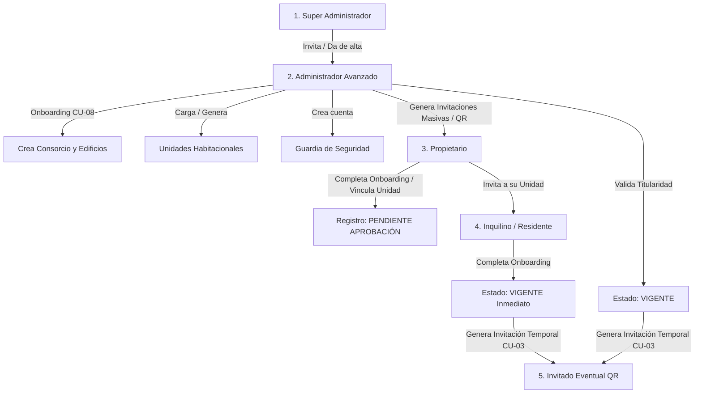

# Guía de Flujo E2E de Alta y Onboarding de Usuarios

Esta guía detalla el paso a paso del flujo de alta, invitación y vinculación de usuarios en la plataforma de consorcios y amenities, cubriendo la jerarquía completa desde el **Super Administrador** hasta el **Usuario Residente / Inquilino**.

---

## 1. Mapa Jerárquico de Creación y Delegación

---

## 2. Flujos Detallados Paso a Paso

### 👑 Nivel 1: De Super Administrador a Administrador Avanzado

**Actor:** `SUPER_ADMINISTRADOR`  
**Escenario:** Incorporación de una nueva empresa administradora de consorcios a la plataforma.

1. **Acción del Super Admin:**
   - Abre el modal de **Alta de Administrador** (`AltaAdministradorModal`).
   - Ingresa: *Nombre, Apellido, Email, Razón Social / Administración, Teléfono*.
   - El sistema invoca `POST /api/invitaciones/crear-admin` (`invitacionService.crearInvitacionAdmin`).
2. **Generación del Token:**
   - El backend genera un token de activación único y seguro con vigencia de 7 días.
   - El Super Admin puede copiar el link generado (`/invitacion/{token}`) o enviar la invitación por correo.
3. **Activación del Administrador:**
   - El Administrador Avanzado hace clic en el enlace, completa su contraseña y confirma sus datos personales en `/invitacion/{token}`.
   - Su cuenta queda activada con el rol `ADMINISTRADOR_AVANZADO`.

---

### 🏢 Nivel 2: Del Administrador Avanzado a la Estructura del Consorcio

**Actor:** `ADMINISTRADOR_AVANZADO`  
**Escenario:** Configuración del consorcio y preparación para el desembarco de los vecinos.

1. **Wizard de Onboarding de Consorcio (`CU-08`):**
   - **Paso 1 (Consorcio):** Nombre, CUIT, Email de contacto, configuración horaria.
   - **Paso 2 (Complejos / Torres):** Bloques, torres o sectores (ej: *Torre A, Torre B*).
   - **Paso 3 (Unidades Habitacionales):** Generación por matriz (ej. Pisos 1 al 10, Deptos A-D) o carga manual/importación de identificadores de unidades.
   - **Paso 4 (Amenities y Guardias):** Alta de amenities (SUM, Parrillas, Gimnasio) y creación directa de usuarios con rol `GUARDIA`.
2. **Despliegue de Invitaciones a Propietarios (`GestionInvitacionesAdmin`):**
   - El administrador accede al panel de invitaciones del consorcio (`/admin/consorcios/{id}/invitaciones`).
   - Visualiza la grilla de departamentos con 3 estados:
     - 🟢 **Registrado / Activo**
     - 🟡 **Invitación Enviada**
     - 🔴 **Sin Invitar**
   - **Métodos de Envío:**
     - **Opción A (Masiva por Email):** Selecciona las unidades pendientes y hace clic en *"Enviar Invitaciones Masivas"* (`POST /api/invitaciones/masivas`).
     - **Opción B (Código QR / Link Abierto del Edificio):** Copia o imprime el código QR general del consorcio (`/invitacion/link-edificio-{id}`) para colocarlo en la cartelera o recepción.

---

### 🏠 Nivel 3: Onboarding y Registro del Propietario

**Actor:** `PROPIETARIO`  
**Escenario:** El vecino recibe la invitación para registrar su unidad habitacional.

1. **Ingreso a la Landing de Invitación (`/invitacion/[token]`):**
   - El sistema valida el token contra `GET /api/invitaciones/validar/{token}`.
   - Si el enlace es general del edificio, el usuario selecciona su unidad habitacional del desplegable. Si vino pre-asignada, se muestra bloqueada.
2. **Declaración de Ocupación:**
   - 🏠 **"Habito la propiedad (Ocupante Actual)"** (`esOcupanteActual = true`): Indica que el propietario vive en la unidad y hará uso de los amenities y servicios.
   - 🔑 **"Alquilo la propiedad / Ausente"** (`esOcupanteActual = false`): Indica que la propiedad está rentada o deshabitada; mantiene acceso a expensas, avisos e historial, pero delega la ocupación a su inquilino.
3. **Formulario de Identificación:**
   - **Usuario Nuevo:** Completa Nombre, Apellido, DNI, Teléfono y define su Contraseña.
   - **Usuario Existente (Multi-propiedad):** Inicia sesión con su cuenta actual para sumar la nueva unidad a su perfil.
4. **Envío de Solicitud (`POST /api/invitaciones/aceptar`):**
   - El sistema crea la cuenta de usuario con rol `PROPIETARIO`.
   - Crea la relación `UsuarioUnidad` en estado **`PENDIENTE_APROBACION_ADMIN`**.
   - El propietario visualiza la pantalla de confirmación: *"Solicitud enviada a la Administración"*.

---

### 🛡️ Nivel 4: Validación y Aprobación por la Administración

**Actor:** `ADMINISTRADOR_AVANZADO`  
**Escenario:** Control y validación de la titularidad de los departamentos.

1. **Revisión en el Panel (`AprobacionVinculacionesModal`):**
   - El administrador consulta la bandeja de solicitudes pendientes (`GET /api/usuario-unidad/pendientes`).
   - Revisa el nombre, DNI, departamento declarado y condición de ocupación del solicitante.
2. **Resolución:**
   - **Aprobar:** Ejecuta `POST /api/usuario-unidad/{id}/aprobar`. La relación pasa a **`VIGENTE`**. El propietario recibe acceso activo inmediato a todas las funciones.
   - **Rechazar:** Ejecuta `POST /api/usuario-unidad/{id}/rechazar` (especificando motivo de inconsistencia documental).

---

### 🔑 Nivel 5: De Propietario a Inquilino / Residente

**Actor:** `PROPIETARIO` $\rightarrow$ `INQUILINO`  
**Escenario:** El propietario autoriza a la persona que habita su inmueble.

1. **Generación de Invitación de Inquilino (`InvitarInquilinoModal`):**
   - El Propietario entra a su panel *"Mis Unidades"* y selecciona su departamento.
   - Hace clic en *"Invitar Inquilino"*, ingresa el email, nombre y teléfono del inquilino.
   - Se invoca `POST /api/invitaciones/inquilino` (`invitacionService.crearInvitacionInquilino`).
2. **Registro Directo del Inquilino:**
   - El inquilino abre el link recibido (`/invitacion/{token}`).
   - Completa sus datos personales y contraseña.
   - Al aceptar (`POST /api/invitaciones/aceptar`):
     - La relación `UsuarioUnidad` se crea de forma inmediata como **`VIGENTE`** (`TipoRelacion = "INQUILINO"`, `esOcupanteActual = true`).
     - **Regla de Negocio:** **No requiere aprobación del Administrador** porque el Propietario es el responsable legal de autorizar a sus inquilinos.

---

### 🎟️ Nivel 6: De Residente (Propietario / Inquilino) a Invitado Eventual

**Actor:** `PROPIETARIO` u `INQUILINO` (con `esOcupanteActual = true`)  
**Escenario:** Autorización de acceso transitorio o evento social (`CU-03`).

1. El residente genera un pase de visita o vincula invitados a una reserva de amenity.
2. El sistema genera un código QR o token temporal que el **Guardia de Seguridad** escanea o valida en la garita de acceso para permitir el ingreso.

---

## 3. Matriz Resumen de Estados de Vinculación

| Perfil Creador | Perfil Registrado | Estado Inicial | Requiere Aprobación Admin |
| :--- | :--- | :--- | :---: |
| Super Admin | Administrador Avanzado | `VIGENTE` / Activo | No (Validado por SuperAdmin) |
| Admin Avanzado | Propietario | `PENDIENTE_APROBACION_ADMIN` | **SÍ** |
| Propietario | Inquilino | `VIGENTE` | **NO** (Responsabilidad del Propietario) |
| Residente Activo | Invitado Eventual | `ACTIVO_TEMPORAL` | No (Controlado por Guardia) |
